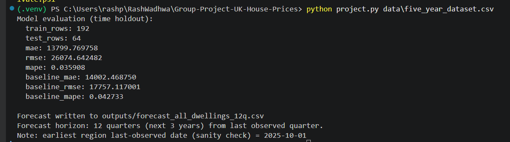
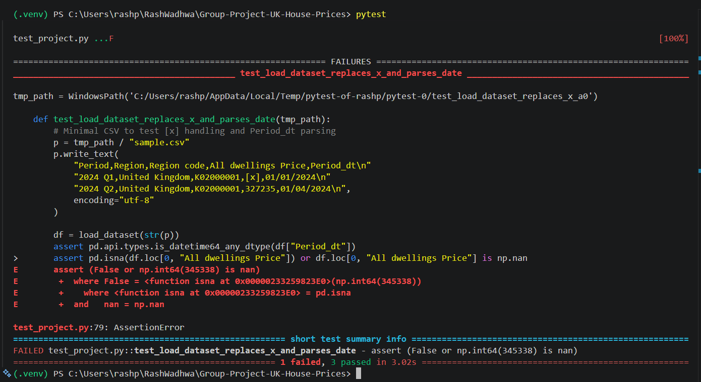
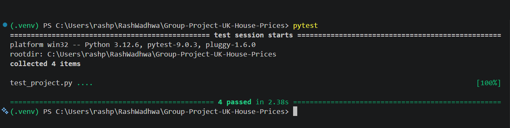
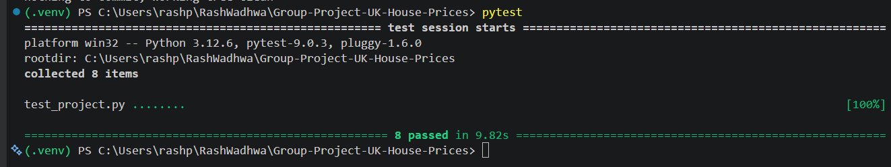

# These screenshots are the proof of output recieved after running the main project.py file and test results conducted to ensure the robustness and consistency of the project.

## This provides the result of modal evaluation summary after running the main project.py file to store the results.

### It proves that not all the test were successful in first attempt of running the Pytest.

### This image showed all the test were passed after fixing the errors.

### The final result showing that all the required test for the project has been successfulll passed.

